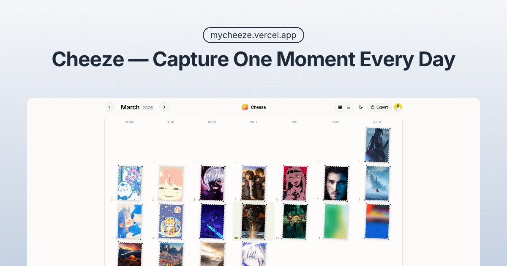

<div align="center">
  
  <br /><br />

  

  <h1>Cheeze</h1>

  <p><strong>One photo. One day. A life in stamps.</strong></p>

  <p>
    Cheeze is a minimalist photo-journal that turns your calendar into a wall of memories.<br />
    Say cheese, pick a moment, and stick it onto your monthly grid — one stamp at a time.
  </p>

  <p>
    <a href="https://mycheeze.vercel.app"><strong>mycheeze.vercel.app →</strong></a>
  </p>

  <br />

  
  
  
  
  
  

</div>

---

## What is Cheeze?

Think of a physical wall calendar with tiny photos stuck onto each day. Cheeze is that — but digital.

- Open the app, pick a date, crop a photo
- It gets cut into a **postage-stamp shape** and placed on your grid
- Come back tomorrow and do it again
- At the end of the month you have a beautiful, tactile visual diary

No feeds. No likes. No noise. Just you and your moments.

---

## Features

### 📅 Monthly & Weekly Views
Switch between a full monthly grid and a focused weekly strip — perfect for a quick glance at your week.

### 🖼️ Stamp-Shaped Photos
Every photo is cropped to a **26×37 postage-stamp aspect ratio**, complete with a perforated scallop border. Each stamp is placed at a subtle random rotation for that "pasted by hand" feel.

### ✂️ In-Browser Crop & Compress
Photos are cropped and compressed entirely in the browser using the Canvas API. Each stamp is kept under **10 KB** — no bloated uploads, no waiting.

### ☁️ Cloud-Backed via Supabase
Stamps are stored in **Supabase Storage** under `user-id/YYYY-MM/YYYY-MM-DD.webp`. Adjacent months are prefetched silently in the background so navigation feels instant.

### 🔐 Auth via Clerk
Sign in with Google (or any Clerk-supported provider). Keyless mode is supported — you can run locally without any Clerk keys.

### 📤 Export
Export your monthly grid as a single image to save or share.

### ⌨️ Keyboard Shortcuts

| Key | Action |
|---|---|
| `←` / `→` | Previous / next month |
| `T` | Jump to today |
| `D` | Toggle dark / light mode |

### 🌙 Dark Mode
Full dark mode support with zero flash — theme is resolved synchronously before paint using a small inline script.

---

## Tech Stack

| Layer | Technology |
|---|---|
| Framework | [Next.js 16](https://nextjs.org/) (App Router) |
| Language | TypeScript 5 |
| Styling | Tailwind CSS v4 |
| UI Components | shadcn/ui + Radix UI |
| Icons | Phosphor Icons |
| Auth | [Clerk](https://clerk.com/) |
| Storage | [Supabase Storage](https://supabase.com/storage) |
| Image processing | Browser Canvas API |
| Toasts | Sonner |
| Linting / Formatting | Biome |

---

## Getting Started

### 1. Clone & install

```bash
git clone https://github.com/your-username/cheeze.git
cd cheeze
npm install
```

### 2. Set up environment variables

Create a `.env.local` file in the root:

```bash
# Supabase
NEXT_PUBLIC_SUPABASE_URL=your-supabase-project-url
SUPABASE_SERVICE_ROLE_KEY=your-service-role-key

# Bucket name (defaults to "stamps" if omitted)
NEXT_PUBLIC_SUPABASE_STAMPS_BUCKET=stamps

# Clerk (optional — keyless mode works without these)
# NEXT_PUBLIC_CLERK_PUBLISHABLE_KEY=pk_...
# CLERK_SECRET_KEY=sk_...
```

### 3. Set up Supabase Storage

1. Go to your [Supabase dashboard](https://supabase.com/dashboard)
2. Navigate to **Storage → Buckets**
3. Create a new bucket named `stamps`
4. Set it to **private** (the app uses signed URLs via the service role key)

Stamps are stored at the path:
```
{user-id}/{YYYY-MM}/{YYYY-MM-DD}.webp
```

### 4. Run the dev server

```bash
npm run dev
```

Open [http://localhost:3000](http://localhost:3000).

---

## Scripts

| Command | Description |
|---|---|
| `npm run dev` | Start the development server |
| `npm run build` | Build for production |
| `npm run start` | Start the production server |
| `npm run lint` | Lint with Biome |
| `npm run format` | Auto-format with Biome |

---

## Project Structure

```
cheeze/
├── app/
│   ├── api/stamps/        # REST endpoints (GET, POST, DELETE)
│   ├── layout.tsx         # Root layout + SEO metadata
│   └── page.tsx           # Entry point
├── components/
│   ├── calendar-grid.tsx  # Monthly & weekly grid layout
│   ├── stamp-cell.tsx     # Individual day cell with stamp rendering
│   ├── stamp-cutter-dialog.tsx  # Photo crop & compress dialog
│   ├── sticker-peel-animation.tsx  # Remove stamp animation
│   ├── export-overlay.tsx # Grid export to image
│   └── toolbar.tsx        # Nav bar with month navigation
├── hooks/
│   ├── use-stamps.ts      # Core stamp state, caching & sync
│   └── use-theme.ts       # Dark / light mode
├── lib/
│   ├── image-processor.ts # Canvas crop, compress & stamp mask
│   └── supabase-*.ts      # Supabase client & storage helpers
└── public/
    ├── logo.png
    ├── favicon.ico
    └── og.webp
```

---

## Stamp Size Limit

Each stamp is hard-capped at **10 KB**. The image processor iteratively reduces WebP quality until the output fits. This keeps the app fast, storage costs minimal, and every stamp loading near-instantly — even on slow connections.

---

## License

MIT — do whatever you like with it.

---

<div align="center">
  <sub>Built with ☕ and a love for small, tactile things.</sub>
</div>